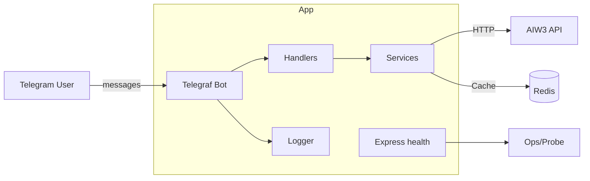

## AIW3 Telegram Bot

Telegram trading bot built with Node.js + TypeScript + Telegraf. It provides price queries, charts, positions, orders, PnL, markets, wallet, invites, and more. Ships with Docker Compose, Redis caching, structured logging, tests, and a minimal health endpoint.

### Core Features
- Commands: `/price`, `/chart`, `/positions`, `/orders`, `/pnl`, `/markets`, `/wallet`, `/invite`, `/points`, `/long`, `/short`, `/close`, `/start`.
- Caching: Redis (prices, candles; default TTL 5 minutes).
- Health: Optional minimal `/health` reporting healthy/degraded/unavailable.
- Logging: Winston JSON logs (files under `logs/` in production).

### Telegram Examples
```
/price BTC      # Query BTC price
/chart ETH 1h   # 1h candlestick chart for ETH
/positions      # Current positions
/orders         # Order history
/pnl            # PnL summary
```

### Health Responses
```bash
curl http://localhost:${HOST_PORT:-38080}/health
```
Healthy (200):
```json
{"status":"healthy","bot":{"isRunning":true},"services":{"api":true,"cache":true}}
```
Degraded (503):
```json
{"status":"degraded","bot":{"isRunning":false},"services":{"api":false,"cache":true}}
```

### Architecture


### Tech Stack
- Runtime: Node.js 18 + TypeScript 5
- Bot: Telegraf
- HTTP: Axios
- Cache: Redis 7
- Logs: Winston
- Tests: Jest + ts-jest

### Project Layout
- `src/bot/{handlers,utils}`: Bot handlers and helpers
- `src/services`: Business services (token, chart, cache, user, invite…)
- `src/config`: Config loader/validation
- `src/types`: Shared TS types
- `src/utils`: Logger, auth, errors, etc.
- `tests/**`: Unit tests (Jest)

### Deploy & Use (Docker Compose)
- Copy env: `cp .env.example .env` and set `TELEGRAM_BOT_TOKEN=123456789:ABC...`
- Start production: `docker compose up --build -d`
- Port mapping: `HOST_PORT` (default 38080) -> container `3000`
- Logs: `docker exec -it aiw3-tgbot sh -lc 'tail -n 200 /app/logs/tgbot.log'`

### Health
- Enable with `HEALTH_ENABLED=true` in `.env`.
- Check: `curl http://localhost:${HOST_PORT:-38080}/health`
- Example (degraded):
```json
{"status":"degraded","bot":{"isRunning":false},"uptime":12.3}
```

### API Examples (service-layer shapes)

Token Price (`CachedTokenData`)
```json
{
  "symbol": "BTC",
  "name": "Bitcoin",
  "price": 50000.12,
  "change24h": 2.5,
  "volume24h": 1000000000,
  "marketCap": 950000000000,
  "high24h": 51000.5,
  "low24h": 49000.2,
  "updatedAt": "2025-09-01T04:00:00.000Z",
  "source": "aiw3_api",
  "isCached": false
}
```

Candles (`CachedCandleData`, excerpt)
```json
{
  "symbol": "ETH",
  "timeFrame": "1h",
  "candles": [
    { "open": 2450.1, "high": 2462.5, "low": 2438.0, "close": 2458.6, "volume": 123456, "timestamp": 1725165600000 }
  ],
  "latestPrice": 2458.6,
  "priceChange24h": -12.3,
  "priceChangePercent24h": -0.49,
  "high24h": 2499.9,
  "low24h": 2401.2,
  "volume24h": 987654321,
  "updatedAt": "2025-09-01T04:00:00.000Z",
  "isCached": true,
  "cache": { "key": "chart_candles_ETH_1h_50", "ttl": 300, "createdAt": "2025-09-01T03:55:00.000Z", "updatedAt": "2025-09-01T04:00:00.000Z" }
}
```

### Local Dev & Tests
- Dev (hot reload): `docker compose --profile dev up bot-dev`
- Tests: `npm test` (Jest + coverage)
- Lint/format: `npm run lint` / `npm run format`

### CI/CD
- GHCR publishing: `.github/workflows/docker.yml`
- Docker Hub publishing (optional): `.github/workflows/dockerhub.yml`
