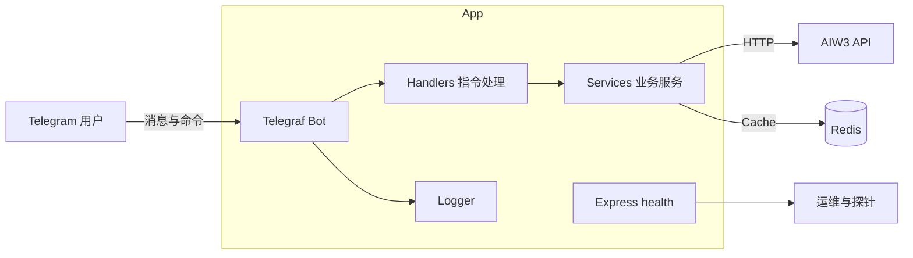

# AIW3 Telegram Bot · [English](README.en.md)

基于 Node.js + TypeScript + Telegraf 的 AIW3 交易系统 Telegram Bot，提供价格查询、仓位、订单、收益、市场概览、K 线图等多项功能，支持 Docker Compose 一键部署与健康检查。

## 🚀 快速开始

### 环境要求
- Node.js >= 18.0.0
- Redis >= 4.6.0
- TypeScript >= 5.1.0

### 安装依赖
```bash
npm install
```

### 配置环境变量
```bash
cp .env.example .env
# 编辑 .env 文件，配置必要的环境变量
```

### 开发模式启动
```bash
npm run dev
```

### 构建生产版本
```bash
npm run build
npm start
```

## 📋 核心功能

- 指令集：`/price`、`/chart`、`/positions`、`/orders`、`/pnl`、`/markets`、`/wallet`、`/invite`、`/points`、`/long`、`/short`、`/close`、`/start`。
- 缓存：Redis（价格/蜡烛图数据缓存，默认 TTL 5 分钟）。
- 健康检查：可选内置 `/health`（最小化，返回 healthy/degraded/unavailable）。
- 日志：Winston 文件与控制台（结构化 JSON，生产写入 `logs/`）。

### 使用示例（Telegram）
```
/price BTC      # 查询 BTC 实时价格
/chart ETH 1h   # ETH 的 1 小时 K 线图
/positions      # 当前持仓
/orders         # 历史订单
/pnl            # 收益情况
```

### 健康检查响应示例
```bash
curl http://localhost:${HOST_PORT:-38080}/health
```
Healthy (200):
```json
{"status":"healthy","bot":{"isRunning":true},"services":{"api":true,"cache":true}}
```
Degraded (503):
```json
{"status":"degraded","bot":{"isRunning":false},"services":{"api":false,"cache":true}}
```

### API 返回示例（服务层）

Token 价格（`CachedTokenData`）
```json
{
  "symbol": "BTC",
  "name": "Bitcoin",
  "price": 50000.12,
  "change24h": 2.5,
  "volume24h": 1000000000,
  "marketCap": 950000000000,
  "high24h": 51000.5,
  "low24h": 49000.2,
  "updatedAt": "2025-09-01T04:00:00.000Z",
  "source": "aiw3_api",
  "isCached": false
}
```

K 线数据（`CachedCandleData`，节选）
```json
{
  "symbol": "ETH",
  "timeFrame": "1h",
  "candles": [
    { "open": 2450.1, "high": 2462.5, "low": 2438.0, "close": 2458.6, "volume": 123456, "timestamp": 1725165600000 }
  ],
  "latestPrice": 2458.6,
  "priceChange24h": -12.3,
  "priceChangePercent24h": -0.49,
  "high24h": 2499.9,
  "low24h": 2401.2,
  "volume24h": 987654321,
  "updatedAt": "2025-09-01T04:00:00.000Z",
  "isCached": true,
  "cache": { "key": "chart_candles_ETH_1h_50", "ttl": 300, "createdAt": "2025-09-01T03:55:00.000Z", "updatedAt": "2025-09-01T04:00:00.000Z" }
}
```

## 🏗️ 总体架构



### 技术栈
- 运行时：Node.js 18 + TypeScript 5
- Bot：Telegraf
- HTTP：Axios
- 缓存：Redis 7
- 日志：Winston
- 测试：Jest + ts-jest

### 目录结构
```
src/
├── bot/                    # Telegram Bot核心
│   ├── handlers/           # 命令处理器
│   └── utils/              # Bot工具类
├── services/               # 业务服务层
├── config/                 # 配置管理
├── types/                  # TypeScript类型
└── utils/                  # 通用工具
```


## 🧪 测试

### 运行测试
```bash
npm test
```

### 监视模式
```bash
npm run test:watch
```

## 🐳 Docker

### 部署与使用（Docker Compose）
```bash
cp .env.example .env
# 填写 TELEGRAM_BOT_TOKEN 等变量
docker compose up --build -d
# 健康检查（启用时）
curl http://localhost:${HOST_PORT:-38080}/health
```

### 开发热重载（Compose Profile）
```bash
cp .env.example .env
docker compose --profile dev up -d redis
docker compose --profile dev up bot-dev
# 观察日志
docker compose logs -f bot-dev
```

镜像由 GitHub Actions 构建并推送到 GHCR：`ghcr.io/<owner>/<repo>:<tag>`。

### 环境变量
- `TELEGRAM_BOT_TOKEN`（必填）
- `API_BASE_URL`、`REDIS_HOST`、`REDIS_PORT`、`LOG_LEVEL`
- `PORT`（默认 3000）
- `HEALTH_ENABLED`（默认 `true`。即使 Telegram 不可达也会启动最小化 `/health`，返回 `healthy/degraded/unavailable`）

提示：本仓库默认将服务端口映射到 `HOST_PORT`（默认 `38080`）以避免冲突。

## 🧰 Makefile 速查

```bash
make install        # 安装依赖
make build          # 构建 TypeScript
make test           # 运行测试
make lint           # 代码检查

make docker-up      # 启动生产栈 (compose)
make docker-logs    # 查看生产日志
make docker-down    # 停止生产栈

make dev-up         # 启动开发栈 (热重载)
make dev-logs       # 查看开发日志
make dev-down       # 停止开发栈
```

CI 已配置：
- GHCR 推送：`.github/workflows/docker.yml`
- Docker Hub 推送（可选，需配置 secrets）：`.github/workflows/dockerhub.yml`

## 🔧 开发规范

- 每个TypeScript文件 < 350行
- 每个目录 < 8个文件
- 完整的TypeScript类型定义
- 单元测试覆盖率 > 80%

## 📚 文档

详细的开发文档请参考：
- [开发实施计划](../docs/development/tgbot_price_implementation_plan.md)
- [架构设计文档](../docs/architecture/tgbot_price_architecture.md)
- [后端任务交接](../docs/development/backend_task_handoff.md)

## 🤝 贡献

请参考项目根目录的 `CLAUDE.md` 了解开发规范和协作流程。

---

**版本**: v1.0.0  
**最后更新**: 2025-08-21
